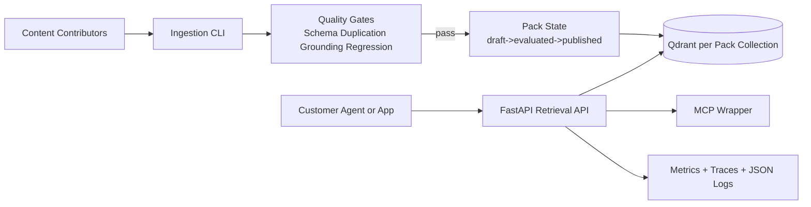

# rag-pipe

A productised, multi-tenant RAG pipeline with pack-versioned retrieval boundaries.

## Architecture

## Repository Layout

- `packs/`: pack manifests and documents
- `ingestion/`: ingestion and CLI
- `retrieval/`: retrieval contracts and orchestration
- `evaluation/`: quality gate logic
- `api/`: FastAPI retrieval endpoint
- `mcp/`: MCP wrapper
- `golden/`: golden question sets

## Quick Start

1. Install dependencies:
   - `python -m pip install -e .[dev]`
2. Start local services:
   - `docker compose up -d qdrant`
3. Run API:
   - `uvicorn api.main:app --reload`
4. Query endpoint:
   - `POST /v1/packs/{pack_id}/query`

## Runbook

### Ingest a pack draft

`pack ingest packs/threat-modelling-aws-war --pack threat-modelling-aws-war --contributor-id team-a`

### Publish workflow

1. Ingest into `draft`.
2. Evaluate against all gates.
3. Publish on pass, or rollback to prior published version.

### API key entitlement model

Set API key mapping as:

`RAG_PIPE_API_KEYS=<api_key>:<customer_id>:<pack_a>|<pack_b>`

Requests for packs outside a customer's allow-list are denied.

## SLO/SLI Definitions

### SLO targets
- Retrieval latency: p95 < 500 ms at 10k chunks per pack.
- Availability: 98%.

### SLIs
- `retrieval_latency_ms`
- `hybrid_hit_rate`
- `rerank_latency_ms`
- `eval_faithfulness`
- `eval_context_precision`

## Notes

- Retrieval is designed to be usable without generation.
- Generation chains remain optional and decoupled.
- Documentation uses Australian English.
