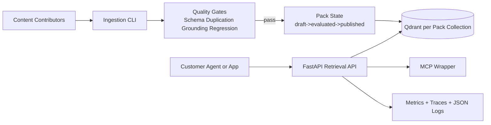

# rag-pipe

A productised, multi-tenant RAG pipeline with pack-versioned retrieval boundaries.

## Architecture



See [`SPEC.md`](SPEC.md) for the full system boundary, data contracts, and SLO/SLI definitions.

## Repository Layout

- `packs/`: pack manifests and documents (e.g. `packs/threat-modelling-aws-war/`)
- `ingestion/`: ingestion pipeline, manifest loader, and `pack` CLI
- `retrieval/`: retrieval contracts and service
- `evaluation/`: quality gate primitives (schema, duplication, grounding, regression)
- `api/`: FastAPI retrieval endpoint and API-key entitlement checks
- `mcp/`: MCP-facing wrapper over the retrieval service
- `golden/`: golden question/answer sets used for grounding evaluation
- `tests/`: `unit`, `security`, `e2e`, and `performance` pytest suites
- `.github/workflows/`: CI, security scanning, release, and deploy pipelines (see below)
- `Dockerfile` / `docker-compose.yml`: container image and local stack (API + Qdrant)
- `SPEC.md`, `CONTRIBUTING.md`, `SECURITY.md`: specification, contributor workflow, and security policy

## Requirements

- Python 3.12+
- [`uv`](https://docs.astral.sh/uv/) for reproducible installs (CI enforces a committed `uv.lock`); plain `pip` also works for local development
- Docker and Docker Compose, to run the local stack or the E2E/performance suites

## Quick Start

1. Install dependencies:
   - `uv sync --locked --dev` (matches CI exactly), or
   - `python -m pip install -e .[dev]`
2. Start local services:
   - `docker compose up -d qdrant`, or `docker compose up -d --build qdrant api` to run the API in a container too
3. Run API:
   - `uvicorn api.main:app --reload`
4. Query endpoint:
   - `POST /v1/packs/{pack_id}/query`
5. Interactive API docs (Swagger UI):
   - `http://localhost:8000/docs` — click **Authorize** and paste an `x-api-key`
     (see `RAG_PIPE_API_KEYS` in the entitlement model below) to try requests
     directly from the browser.
   - ReDoc: `http://localhost:8000/redoc`
   - Raw OpenAPI schema: `http://localhost:8000/openapi.json`

## Test Framework

The repository provides four pytest suites, selected via markers:
- Unit: `pytest -m unit`
- Security: `pytest -m security`
- End-to-end: `pytest -m e2e` (requires the API + Qdrant running, e.g. via `docker compose up -d --build qdrant api`)
- Performance smoke: `pytest -m performance`

Run all tests: `pytest`

Run with coverage (matches the CI quality gate):
```
pytest tests/unit --cov=api --cov=evaluation --cov=ingestion --cov=mcp --cov=retrieval --cov-report=term-missing
```
CI requires the `unit` and `security` suites to each independently reach **80% line coverage** across `api`, `evaluation`, `ingestion`, `mcp`, and `retrieval`.

## CI/CD

GitHub Actions runs several workflows:

### `ci.yml` — pull requests and pushes to `main`
Jobs run in dependency order, each gating the next:
1. **Pre-build lint** — `ruff check` and `ruff format --check`.
2. **Version pinning and lockfile integrity** — asserts every dependency is exactly pinned and `uv.lock` matches `pyproject.toml` (`uv lock --locked`, `uv sync --locked --dev`).
3. **SCA exception register expiry** — fails if any entry in `.sca-exceptions.json` has expired.
4. **Tests with coverage** (`unit`, `security`) — runs each suite with coverage, uploads JUnit/coverage artifacts.
5. **Mutation testing (non-blocking)** — `mutmut` against `retrieval/`, PR-only, does not fail the build.
6. **SCA (Python)** — `pip-audit`, blocking on unexcepted HIGH/CRITICAL findings.
7. **Code quality gate** — aggregates the coverage artifacts from step 4 and enforces the 80% threshold per suite.
8. **Production build** — builds the sdist/wheel and asserts the expected `dist/` artifacts exist.
9. **Container build (no push)** — builds the API Docker image without pushing.
10. **E2E smoke** — brings up `docker compose` (Qdrant + API), polls `/health`, then runs `tests/e2e`.
11. **Performance test (two-phase)** — runs `tests/performance` against the live stack twice, with a constrained profile (p95 < 200ms) and a full profile (p95 < 50ms); both are stricter than the SPEC's p95 < 500ms target.

### `security.yml` — pull requests and pushes to `main`
- **Secrets scan** — `gitleaks detect`, report-first with a baseline (`.gitleaks-baseline.json`), blocking on unbaselined findings, uploads SARIF to Code Scanning.
- **SAST (Python)** — `semgrep` (`p/python` ruleset), blocking on ERROR/HIGH/CRITICAL findings not covered by `.sast-exceptions.json`.
- **SAST/SCA exception register expiry** — fails if exception entries have expired.
- **SCA (Python)** — `pip-audit`, mirrors the check in `ci.yml`.
- Uploading SARIF from the Secrets scan and SAST jobs requires **GitHub Code Scanning** to be enabled for the repository (Settings → Security → Code security and analysis).

### `sonarcloud.yml` — pull requests and pushes to `main`
Runs `SonarSource/sonarcloud-github-action`. **Not yet configured**: the workflow ships with blank `-Dsonar.projectKey=` / `-Dsonar.organization=` args and requires a `SONAR_TOKEN` repository secret. To enable it:
1. Import the repository on [SonarCloud](https://sonarcloud.io) and note its project key and organization key.
2. Fill in `args` in `.github/workflows/sonarcloud.yml` with those keys.
3. Add a `SONAR_TOKEN` repository secret (SonarCloud → My Account → Security).

### `dependabot-auto-merge.yml`
Runs the real test suites (`unit`, `security`, `e2e`, `performance`) against Dependabot PRs, then auto-merges patch/minor updates (squash) and labels major/unrecognised updates `needs-manual-review` for a human to review.

### `mutation.yml` — manual dispatch or pushes to `release/**`
Extended `mutmut` run against `retrieval/`, separate from the non-blocking PR check in `ci.yml`.

### `release.yml` — manual dispatch
Cuts a release: bumps the version in `pyproject.toml`, `api/main.py`, and the seed pack manifest, generates a deterministic changelog from git log, pushes a `release/vX.Y.Z` branch, and opens a PR with squash auto-merge enabled against the chosen target branch.

### `release-tag.yml` — triggered when a `release/*` PR merges to `main`
Tags the merge commit `vX.Y.Z` and publishes a GitHub Release using the PR body as release notes.

### `deploy.yml` — triggered by pushing a `v*.*.*` tag
Validates that the tagged commit has successful CI evidence (fail-closed if none is found), builds the container image, scans it with Trivy (blocking on HIGH/CRITICAL vulnerabilities), pushes to GHCR, applies `deploy/apply.sh`, and runs a bounded-retry smoke test against `PROD_HEALTH_URL`. Supports manual rollback via `workflow_dispatch` with a `rollback_tag` input.

### Third-party checks
GitGuardian and Semgrep OSS also run as external GitHub App integrations (not workflows in this repo) and appear as additional required checks on pull requests.

## Runbook

### Ingest a pack draft

`pack ingest packs/threat-modelling-aws-war threat-modelling-aws-war --contributor-id team-a`

### Publish workflow

1. Ingest into `draft`.
2. Evaluate against all gates.
3. Publish on pass, or rollback to prior published version.

### API key entitlement model

Set API key mapping as:

`RAG_PIPE_API_KEYS=<api_key>:<customer_id>:<pack_a>|<pack_b>`

Requests for packs outside a customer's allow-list are denied (`403`); requests with a missing or unrecognised key are rejected (`401`).

### Cutting a release

1. Run `release.yml` via `workflow_dispatch`, choosing a bump type (`patch`/`minor`/`major`) and a target branch.
2. The workflow opens `release/vX.Y.Z` against that target with auto-merge enabled.
3. On merge, `release-tag.yml` tags the commit and publishes a GitHub Release.
4. Pushing the resulting tag triggers `deploy.yml`, which builds, scans, and deploys the container image (see above). To roll back, dispatch `deploy.yml` with `rollback_tag` set to a previously deployed tag.

## SLO/SLI Definitions

### SLO targets
- Retrieval latency: p95 < 500 ms at 10k chunks per pack.
- Availability: 98%.

### SLIs
- `retrieval_latency_ms`
- `hybrid_hit_rate`
- `rerank_latency_ms`
- `eval_faithfulness`
- `eval_context_precision`

## Notes

- Retrieval is designed to be usable without generation.
- Generation chains remain optional and decoupled.
- Documentation uses Australian English.
